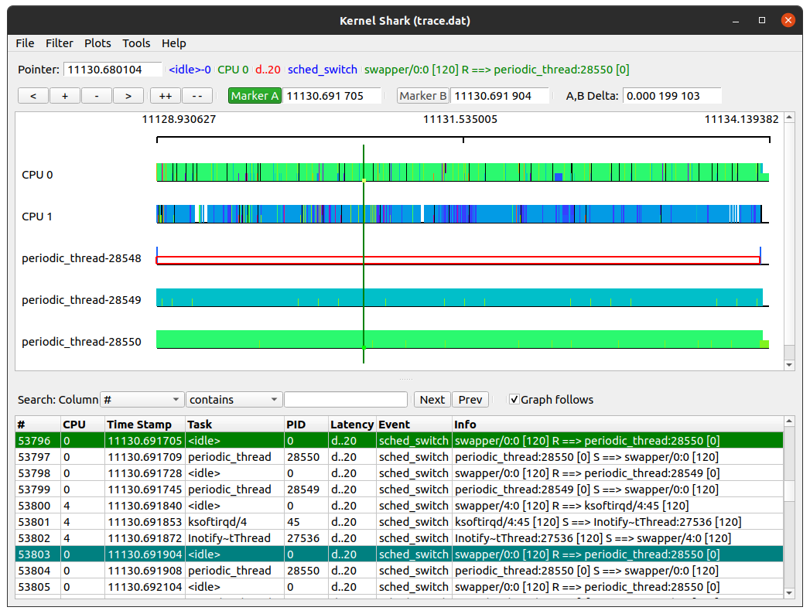
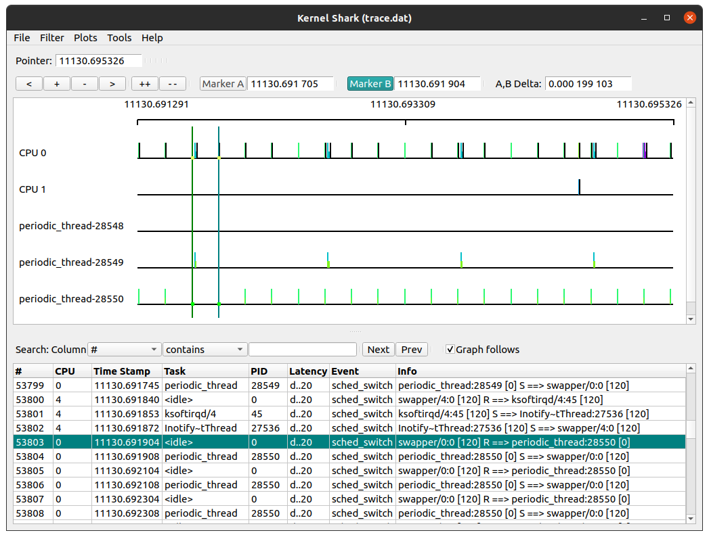

# Real Time Threads with PREEMPT_RT 
Example implementaion of real time threads with wrapper for POSIX thread.

# Prerequisite
<b>⚠️ NOTE:</b> Make sure you have already patched `PREEMPT_RT` kernel, follow [instruction.md](instruction.md) to patch and install. To patch Raspberry PI 4 kernel with `PREEMPT_RT` follow  instructions from [raspberry-pi-rt.md](raspberry-pi-rt.md)

# Building real time periodic thread
Download the source code and compile
```console
git clone https://github.com/siddharthdeore/preempt.git
cd preempt
mkdir build && cd build
cmake ..
make
```

Execute example program with PREEMPT_RT
```console
cd ../bin
sudo ./rt_thread
```
Test CPU affinity (pin thread to core)
```console
./cpu_affinity
```
To check CPU affinity use [htop](https://en.wikipedia.org/wiki/Htop) system monitor, cores which have thread pinned succussfully shall show 100% CPU consumption.
Or use `taskset` to check on which CPU core a process running 
```
taskset -c -p $(pidof cpu_affinity)
```

# Tracing and diagnostic
install kernel tracer tools trace-cmd and KernelShark 
```console
sudo apt-get install -y trace-cmd
sudo apt-get install -y kernelshark
```
Trace CPU `sched_switch` event
```console
sudo trace-cmd record -e sched_switch ./rt_thread
```
Analize CPU trace with KernelShark GUI

```console
kernelshark trace.dat
```
<center>


Fig: Kernelshark CPU trace for sched_switch event 



Fig: Kernelshark sched_switch event ticks (zoom).
</center>

# Troubleshoot

Issue: Unexpected freeze issue on COM Express Type 6

<b> Description: </b>

COM Express running Ubuntu 20.04 LTS freezes unexpectedly, this recurrent behavior has been noticed when processor usage goes close to 100%
similar issue arise on when program/threads uses all processor cores, and when real time thread is affine to specific core.

<b> Solution: </b>

This behaviour obsereved with Ubuntu 18.04 LTS and 22.04 LTS and expected cause of such freezes is related to "CPU Power Management".
Disabling all CPU power managements seems to have solved problem.
Steps to Disable

Press "F2" or "DEL" key to enter Aptio Bios Setup utility.
Select Advanced Tab
```console
> Advanced
  > Power & Performance
    > CPU - Power Management Control
        Set Boot mode                   [Turbo Performance]
        Intel(R) SpeedStep(tm)          [Disable]
        Race To Halt (RTH)              [Disable]
        Intel(R) Speed Shift Technology [Disable]
        HDC Control                     [Disable]
```

⚠️ <b>Important (Only for Xenomai)</b>: Problems on [Xenomai](https://source.denx.de/Xenomai/xenomai/-/wikis/home) ipipe kernel  CPU affinity
<p>
Current kernel `cmdline` flags can be checked with following command,

```console
cat /proc/cmdline 
```
To disable DWC features add following flags to kernel cmdline
```console
dwc_otg.fiq_enable=0 dwc_otg.fiq_fsm_enable=0 dwc_otg.nak_holdoff=0 
```
## CPU Isolation (Xenomai)
Remove the CPU 0 and CPU 1 from the general kernel SMP balance and scheduler algorithms.

```console
isolcpus=0,1 xenomai.supported_cpus=0x3
# above line isolates cpu 0 and 1 from SMP balance, and set xenomai supported cpu mask to 0011
```
To set flags edit `/etc/default/grub` and add flags to GRUB_CMDLINE_LINUX_DEFAULT, finaly update grub with `sudo update-grub`


RPI : flags can be set by adding above lines to `/boot/cmdline.txt`,  
</p>


# TODO
- ~~realtime periodic thread Program~~
- ~~cpu affinity~~
- ~~thread priority~~

- Some of the tools listed below to be tested and integrated
    - Linux Trace Toolkit
    - Dynamic Probes
    - kGDB (kernel debugger)
    - Linux Kernel Crash Dump
    - Linux Test Project
    - LMBench
    - Ballista
    - strace
    - System Call Tracker

# Maintainers
This repository is maintained by:

|   | [Siddharth Deore](https://github.com/siddharthdeore) |
|--|--|
