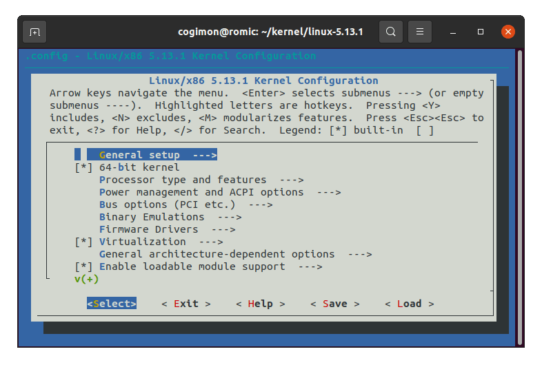
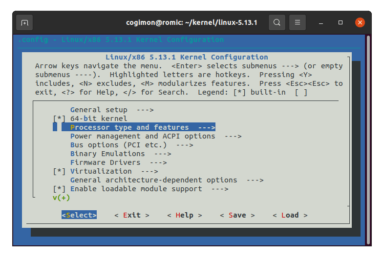
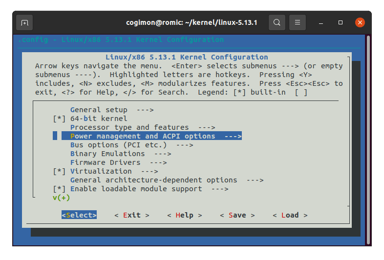
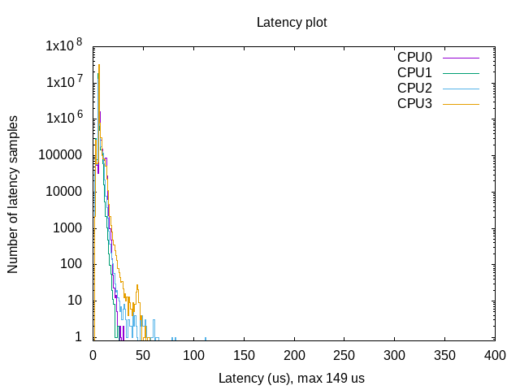

# The Real Time Linux


This repository contains instruction to patch and install linux PREEMPT_RT, test the installation with standard rt-tests routines and example codes to create real time threads. Before starting installation please go through [reference](#reference) section mentioned at the end of this file.


Setting up Preempt RT real time kernel involves steps mentioned below
- [Download Linux Kernel Source Code](https://cdn.kernel.org/pub/linux/kernel/)
- [Download the PREEMPT_RT patch](https://rt.wiki.kernel.org/index.php/Main_Page)
- [Patch the kernel](https://www.kernel.org/doc/html/v4.11/process/applying-patches.html)
    - Build and Install the kernel
    - Update the grub boot and restart
    - Select perefered RT kernel from grub boot menu
- [Validate the installation with rt-tests](https://wiki.linuxfoundation.org/realtime/documentation/howto/tools/rt-tests)

- Make your own Real time application
# Patch Build and Install
Following installation instructions are tested on system running 64bit Ubuntu 20.04.3 LTS with 5.11.0-36-generic kernel.

We need some tools to build kernel.
```console
 sudo apt-get install build-essential libnuma-dev
 sudo apt-get install libncurses5-dev flex bison openssl libssl-dev dkms
 sudo apt-get install libelf-dev libudev-dev libpci-dev libiberty-dev
 sudo apt-get install autoconf fakeroot
 sudo apt install dwarves
 sudo apt install zstd

 ```

Make a directory named kernel in desired location
```console
mkdir -p ~/kernel
cd -p ~/kernel
```

print kernel version and machine related information, here we have linux kernel version 5.11.3, I would prefere to build and patch nearest kernel version to existing one.
```console
uname -a
```
Download suitable linux kernel source from [Linux kernel page](https://cdn.kernel.org/pub/linux/kernel/), preferebly same version already installed on system.
```console
wget https://mirrors.edge.kernel.org/pub/linux/kernel/v5.x/linux-5.11.3.tar.gz
```
Extract source code in current directory.
```console
tar -xzf linux-5.11.3.tar.gz 
```
Download and extract sutaible PREEMPT_RT version source code from [Linux RT page](https://cdn.kernel.org/pub/linux/kernel/projects/rt/). 

```console
wget http://cdn.kernel.org/pub/linux/kernel/projects/rt/5.11/older/patch-5.11-rt7.patch.gz

gunzip patch-5.11-rt7.patch.gz 
```
Apply the patch to kernel source code.
```console
cd linux-5.11.3
patch -p1 < ../patch-5.11-rt7.patch 
```
To ensure that the RT kernel supports the current distribution, we need to copy current configration settings
```console
# cp /boot/config-5.11.0-36-generic .config
cp /boot/config-$(uname -r) .config
```
Keep defualt settings by automaticaly setting yes to old configration.
```console
yes '' | make oldconfig
```
Menuconfig allows us to choose linux features, in this case PREEMPT_RT patch related functionality.
```console
make menuconfig
```
Configure following settings by navigating GUI menu


### 1. Timer tick handling (Full dynticks system (tickless))
```
# Enable CONFIG_NO_HZ_FULL
 -> General setup
  -> Timers subsystem
   -> Timer tick handling (Full dynticks system (tickless))
    (X) Full dynticks system (tickless)
```



### 2. Preemption Model (Fully Preemptible Kernel (Real-Time))
```
# Enable CONFIG_PREEMPT_RT
 -> General Setup
  -> Preemption Model (Fully Preemptible Kernel (Real-Time))
   (X) Fully Preemptible Kernel (Real-Time)
```


### 3. Timer frequency

```
# Set CONFIG_HZ_1000 (note: this is no longer in the General Setup menu, go back twice)
 -> Processor type and features
  -> Timer frequency (1000 HZ)
   (X) 1000 HZ
```



### 4. Default CPUFreq governor

```
# Set CPU_FREQ_DEFAULT_GOV_PERFORMANCE [=y]
 ->  Power management and ACPI options
  -> CPU Frequency scaling
   -> CPU Frequency scaling (CPU_FREQ [=y])
    -> Default CPUFreq governor (<choice> [=y])
     (X) performance
```



In your kernel configuration file spesificaly when compiling on Ubuntu (debian) you will find this line:

```console
CONFIG_SYSTEM_TRUSTED_KEYS="debian/canonical-certs.pem"
CONFIG_SYSTEM_REVOCATION_KEYS="debian/canonical-revoked-certs.pem"
```
Change it to this:
```console
CONFIG_SYSTEM_TRUSTED_KEYS=""
CONFIG_SYSTEM_REVOCATION_KEYS=""
```

if you see any error related to SYSTEM_TRUSTED_KEYS try following

```console
scripts/config --disable SYSTEM_TRUSTED_KEYS
scripts/config --disable SYSTEM_REVOCATION_KEYS
```

Compile Kernel source file with -jX flag, here X nuber of core
```console
sudo make -j20
```
Make modules and install 
```console
sudo make modules_install
sudo make install 
```
Now update grub and restart the system and select patched kernel version from grub boot menu
```console
sudo update-grub
reboot
```
Check the kernel version
```console
uname -a
```
# Troubleshoot
If you are not able to boot in to letest pached kernel and get message simillar to loading ramdisk or below,
```console
Kernel panic - not syncing
VFS: unable to mount root fs on unknown block(0,0)
```
check installed kernels
```console
find /boot/vmli* # for list of all kernels
find /boot/vmli* | grep rt # for rt kernels
```
Edit initramfs and set `MODULES=dep`
```
sudo gedit /etc/initramfs-tools/initramfs.conf
```
Update initramfs with your rt kerenel version, in this case "5.11-rt7"

```
sudo update-initramfs -c -k 5.11-rt7
sudo update-grub
reboot
```

# Testing
rt-tests is a test suite, that contains programs to test various real time Linux features.
```console
git clone git://git.kernel.org/pub/scm/utils/rt-tests/rt-tests.git
cd rt-tests
make all
make install
```

Download the test bash script and run test, (Take few hours) script generates latency plot and requires gnuplot do make plot.png.
```console
https://www.osadl.org/uploads/media/mklatencyplot.bash
chmod +x mklatencyplot.bash
sudo ./mklatencyplot.bash
```
N.B. We need super user permision to use PREEMPT_RT

Show or change the real-time scheduling attributes of a process
```console
# Set policy:
# chrt [options] <priority> <command> [<arg>...]
# chrt [options] --pid <priority> <pid>
#
#Get policy:
# chrt [options] -p <pid>
# Policy options:
# -b, --batch          set policy to SCHED_BATCH
# -d, --deadline       set policy to SCHED_DEADLINE
# -f, --fifo           set policy to SCHED_FIFO
# -i, --idle           set policy to SCHED_IDLE
# -o, --other          set policy to SCHED_OTHER
# -r, --rr             set policy to SCHED_RR (default)
sudo chrt --rr 99 ./app_name

```
To set process priorities
```console
# https://www.howtoforge.com/linux-chrt-command/
# Get process ID
pidof <process_name>
# check priority status
sudo chrt -p <pid>
# change policy to real time SCHED_RR
sudo chrt -r -p 99 <pid>
```

Latency Plot




# <a name="reference"></a> References
1. [F. Reghenzani, The real-time Linux kernel: a Survey on PREEMPT_RT](https://web.archive.org/web/20210305000638/https://re.public.polimi.it/retrieve/handle/11311/1076057/344112/paper.pdf)
2. [A realtime preemption overview](https://web.archive.org/web/20220126075157/https://lwn.net/Articles/146861/)
3. [The Linux Foundation Real Time Linux](https://wiki.linuxfoundation.org/realtime/documentation/start)
4. [Giuseppe Lipari, Lesson notes - Programming RT systems with pthreads](https://web.archive.org/web/20170517102136/http://retis.sssup.it/~lipari/courses/str09/10.rtprogramming-handout.pdf)
5. [Frank Vasquez, Chris Simmonds, "Mastering Embedded Linux Programming".](https://books.google.it/books?id=4Hc5DwAAQBAJ&lpg=PP1&hl=it&pg=PP1#v=onepage&q&f=false)
6. [P. Ficheux, Using real-time with Linux](https://web.archive.org/web/20210924153548/https://etr2021.ensma.fr/files/p-ficheux-realtime-linux.pdf)

# Maintainers
This repository is maintained by:

|   | [Siddharth Deore](https://github.com/siddharthdeore) |
|--|--|
